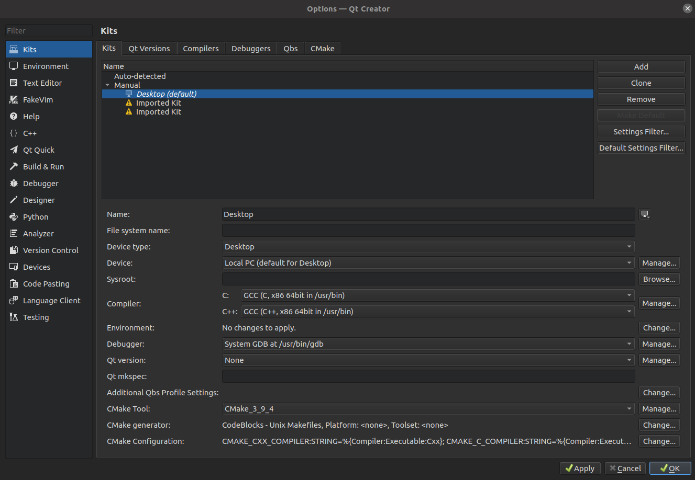

## Overview
Non Point Source Assessment Tool


## Dependencies
- [Deal.ii 9](https://www.dealii.org/) 
Deal library has quite a few options on how to compile. The easiest seems to be the ([Candii](https://github.com/koecher/candi)) distribution which involves just one line:

    
    ```
    ./candi.sh -j 4 --prefix=Path/to/candi/compiled/libs
    ```

    (If you dont have more than 16 GB ram then use `-j 2` or even without `j`). 
    

- [CGAL](https://www.cgal.org/).
It is highly recommended to use version [4.11.3](https://github.com/CGAL/cgal/releases/tag/releases%2FCGAL-4.11.3)  as earlier or later compiled versions have failed to be compiled together with NPSAT. 
If you already have a CGAL installation from sources (e.g.`sudo apt-get install libcgal-dev`) then it may work even if the installed version is not the specific one. 
To find out about the compiled version compile and run this [program](https://gist.github.com/alecsphys/7398446).

    If you follow the installation guide from the library then you will do the following
    ```
    cd /path/to/cgal-releases-CGAL-4.11.3
    mkdir -p build/release
    cmake -DCMAKE_BUILD_TYPE=Release ../..
    make
    ```
    If you installed CGAL from the repositories the you may not know how to define the CGAL_DIR:PATH. A little trick to find out is the following:
    ```
    mkdir cgalfoo
    cd cgalfoo
    cgal_create_cmake_script
    cmake .
    ```
    This will create a CMakeCache.txt file. Search for CGAL_DIR in that file.

    Last, dont forget to delete the foo folder `rm -r cgalfoo`
- [Boost](https://www.boost.org) Nowadays almost every project needs boost. However the installation deall.ii takes care of that.


## Build NPSAT
To compile the NPSAT code run the following command from the directory where the npsat.cc file is.
```
cmake -DDEAL_II_DIR=Path/to/candi/compiled/libs/deal.II-v9.0.0 -DCGAL_DIR:PATH=/path/to/cgal-releases-CGAL-4.11.3/build/release .
make
```

## Building with Spack
[Spack](https://spack.io/) is a package manager with the aim to remove the hurdle of building libraries along with their dependencies. 

First we need to [install](https://spack.io/about/) spack which can't get any easier.

To keep spack organized we will create the environment `DealCgal` to put the libraries
```
spack env create DealCgal
spack env activate DealCgal
``` 

Next we can build any library with just few lines of code. However there are few tweaks that one should take into account. For the time being the only workable installation of deal under ubuntu 19.04 is the following:
```
spack install dealii target=x86_64 ^cmake@3.9.4^netcdf@4.7.1
```
The above line will get and build deal and all of the dependencies. This is going to take an hour or so.

Similarly we can install cgal
```
spack install cgal target=x86_64 ^cmake@3.9.4
``` 
Next we navigate to a folder where we want to copy all the files. If for example we would like to have the libraries copied to Documents/Path/to/myDealii_lib then we do the following:
```
cd Documents/Path/to/
spack view -v symlink myDealii_lib dealii
```
This will create the folder myDealii_lib and copy all the nessecary files. If there are errors asking to append the -i flag then do
```
spack view -v symlink myDealii_lib dealii -i
```
We can also copy the cgal files to the same folder as 
```
spack view -v symlink myDealii_lib cgal
```
The [deal in Spack](https://github.com/dealii/dealii/wiki/deal.II-in-Spack#known-issues-using-spack) documentation suggests to use the cmake 3.9.4 version. With spack we can install any version that is available. Again to stay organized we recommend to use spack environments:
```
spack env create CMAKE
spack env activate CMAKE
spack install cmake@3.9.4 target=x86_64
cd Documents/Path/to/
spack view -v symlink CMAKE_3.9.4 cmake@3.9.4
```
The above commands will create the environment _CMAKE_, make it active, build cmake 3.9.4 and the create a folder and copy the cmake files into that folder. The cmake executable lives now in `Documents/Path/to/CMAKE_3.9.4/bin/cmake`.

Finally to compile npsat_engine we have to first make sure that we are in the right environment
```
set env activate DealCgal
```
clone the repository
```
git clone https://github.com/UCD-GW-Nitrate/npsat_engine.git
cd npsat_engine
```
configure it
```
..../path/to/CMAKE_3.9.4/bin/cmake -DDEAL_II_DIR=..../Path/to/myDealii_lib -DCGAL_DIR:PATH=..../Path/to/myDealii_lib .
```
and build it
```
make
```

### Tweaks of QTCreator with spack 
When I used spack to build Npsat engine, I had difficulties to configure QTCreator. 

Here is a list of tweaks.
First go to __Tools->Options->Kits->CMake__ and add a Manual cmake configuration where the name can be anything e.g CMake_3_9_4, the path should be the same as above `.../path/to/CMAKE_3.9.4/bin/cmake` and make sure that both Autorun CMake and Auto-create built directories are checked and apply.

Next go to **Tools->Options->Kits->Kits** and make default the Manual Desktop. It is important here to make sure that the selected CMake Tool is the one that we created previously 



Last, to import the project into the QT creator File->Open File or Project and select the [CMakeList.txt](https://github.com/UCD-GW-Nitrate/npsat_engine/blob/topo/CMakeLists.txt) file. On the next menu select Desktop configuration only and deselect any imported ones. Expand the desktop and keep the Debug only and change the build path to the npsat_engine.


## Run

Although the simulation of non point source pollution is a 3D problem the code is designed to run 2D problems, where only a cross section of the domain is considered. 
The NPSAT code can be compiled to run either 2D or 3D problem. 
Inside the headers folder there is a header file *my_macros.h* which includes the definition of the dimension. Change this to 2 or 3 according to the problem being solved

```
 #define _DIM 2
```


#### Calculate flow & particle tracking
To run NPSAT you need to prepare a main parameter file. Then you can do:
```
mpirun -n nproc path/to/executable/npsat -p parameter_file.npsat
```
This is going to execute the problem described in the parameter file. using `nproc` processors. If the particle tracking is on, then most likely the particle trajectories have been written in several files per processor, where each file contains segments of the particle trajectories. To do anything useful with them you need first to gather them. You can do so by running the following
```
path/to/executable/npsat -p parameter_file.npsat -g nproc nchunk
```
where `nproc` is the number of processors that where used during the simulation and `nchunk` is a number that is specified at the end of the simulation. 

#### Compute URFs
This gather step is going to generate one or more files with the suffix *.urfs. This contains the data in a suitable format for Unit Response Function calculation. 

From matlab or octave simply call 
```
WellURF = readURFs(filename);
```

Keep in mind that this is going to look for some [msim](http://subsurface.gr/software/msim/) commands. Therefore you need to make sure that the msin folders have been added to matlab search path.

That concludes the workflow of this tool.

For using the URFs see [Mantis](https://github.com/giorgk/Mantis) 


Happy pollution predicting!

## Run NPSAT in cluster
Both dependencies of NPSAT can be compiled and installed locally. Therefore to compile the code in a cluster should be similar to a desktop. If the cluster uses [SLURM](https://slurm.schedmd.com/) for managing the workload then you can submit jobs to the cluster using the following guide:

* Create a file for example *run_job.sbatch* with content similar to the following:
```
#!/bin/bash
#
# job name:
#SBATCH --job-name='CVHM'
#
# Number of tasks (cores):
#
#SBATCH --ntasks=64
#
#SBATCH --output=out%j.log
#SBATCH --error=out%j.err
#
#####SBATCH --dependency=singleton
#
# Load your modules
module purge
module load system-gcc/openmpi-2.1.5
#
# Set up your environment 
cd /path/to/the/parameter/file
#
# Start your MPI job
mpirun /path/to/executable/npsat -p parameter_file.npsat

```
 
* Most of the options are quite self explainatory. 
    * **job-name** is just a text name to identify the job when for example use the `squeue -u username` to see the progress of the jobs. 
    * **ntasks** is similar to `nproc`. defines the number o processors that are requested to run the job.
    *  **output** is the file where the output of the programm will be printed. Note that the format out%j.log will write the output of the program to the file out####.log where #### is a unique id for the submitted job
    * **error** Possible errors during the run will be reported here.
    * There are many more options one can define. These is just a minimum list of options.
    
* Next we define the required modules. Note that the options here depended highly on the cluster.

* Setting up the environment simply amounts to navigating to the folder where the files are 

* Finally we start the parallel process using a command similar to the one was used in the desktop. However we omit the `-n` option.
* Run the job:
```
sbatch run_job.sbatch
```


---
### Usefull commands
* **Slurm common commands**
When a job is running on the cluster use `squeue -u username` to see the status of the job. 
If for any reason you need to kill the job, find the job id by running the squeue and then ```scancel jobid```


* **Transfer results from cluster**
To transfer the result from the cluster to local machine the admins suggest the rsync over scp. For example to tranfer the *urfs files on the current folder do:
```
rsync -azvhe ssh name@aqua.lawr.ucdavis.edu:/path/of/the/results/*.urfs .
```
or for the farm cluster
```
rsync -e "ssh -p 2022" --archive name@farm.cse.ucdavis.edu:/path/of/the/results/*.urfs .
```
* **Delete many files**
The simulation depending the number of processors and the number of particle tracking may create a large number of files. The command `rm -r` to delete all files let's say from the output folder may fail.
An alternative command is ([see details](https://stackoverflow.com/questions/14731133/how-to-delete-all-files-older-than-3-days-when-argument-list-too-long?rq=1)):
```
find . -mtime +3 | xargs rm -Rf
```
It is also usefull to find the number of files in a directory. The following does that ([see more](https://askubuntu.com/questions/370697/how-to-count-number-of-files-in-a-directory-but-not-recursively)):
```
find -maxdepth 1 -type f | wc -l
```

    
    
    
    


