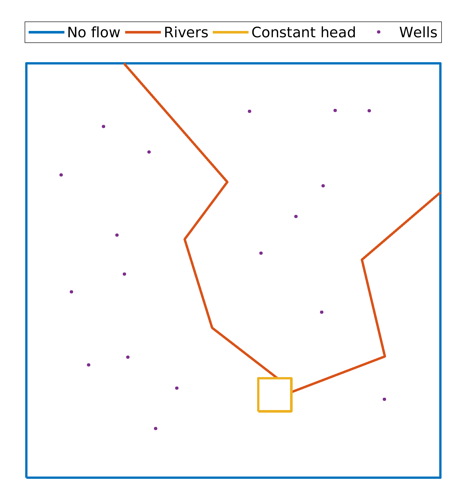
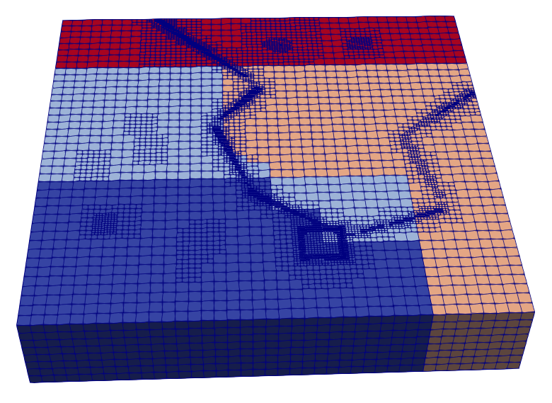
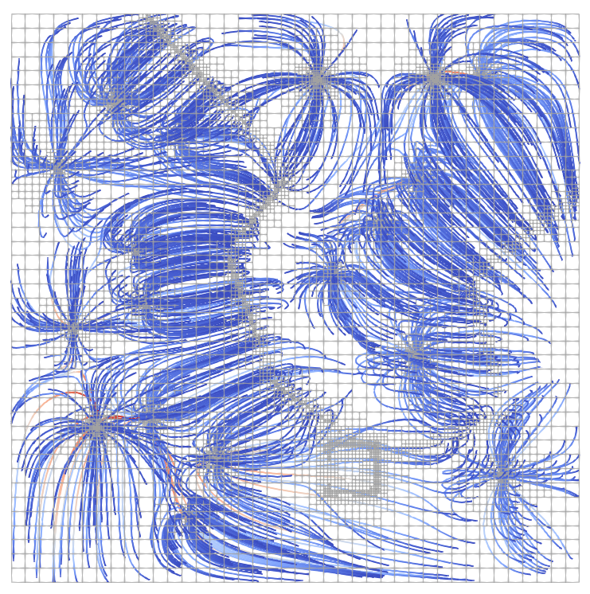
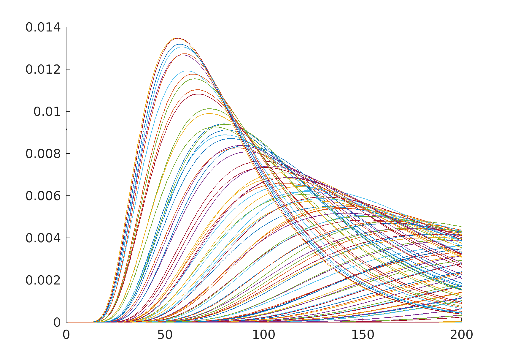
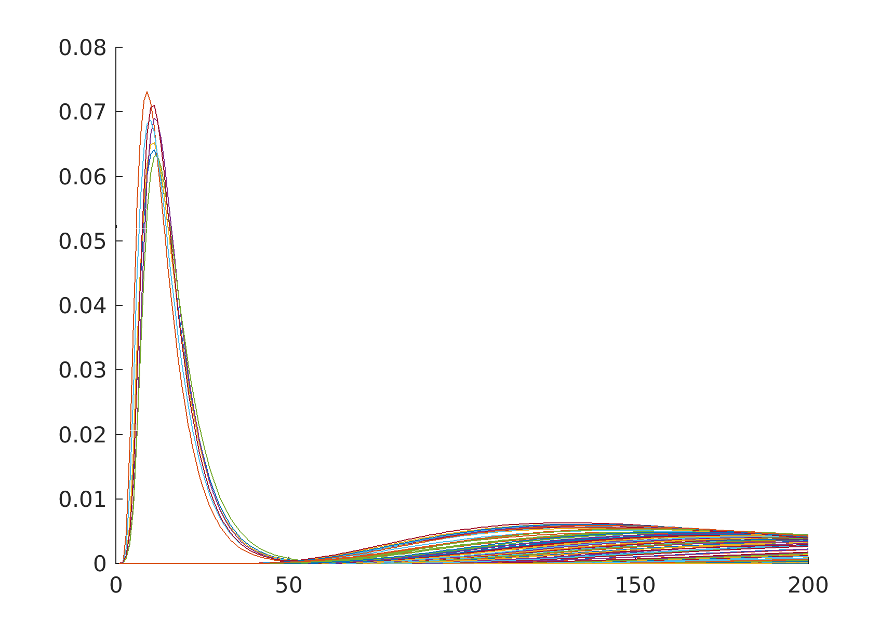
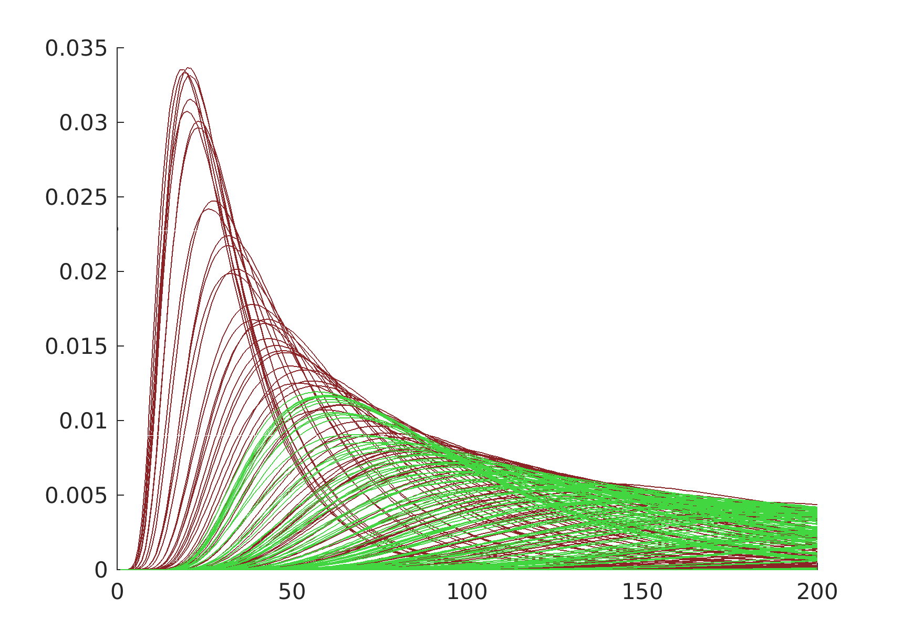

# BOX NPSAT
This example shows how to run a non point source pollution simulation from start to finish. Describes all the steps to solve the flow, run particle tracking, compute the Unit Response Functions, and do some plotting.

## Aquifer description
- The domain is a rectangular area with 5 km length. 
- The boundaries that surround the aquifer are treated as no flow boundaries (blue line).
- There is a small rectangle highlighted with orange line that is constant head equal to 30 m. 
- The groundwater recharge is uniform and equal to 0.00018 m/day.

- There are also two rivers that recharge the area with 894 m^3/day.
- There are 18 wells that pump 5365 m^3/day approximately. This is almost equal to the volume of water coming from the groundwater recharge and streams, therefore the groundwater budget is approximately 0.



## Simulate Flow only
The first step is to modify the input and output folders by setting the following parameters which can be found under the **subsection A. Workspace directories**:
```
set a Input directory  = /home/giorgk/CODES/NPSAT/examples/BoxNPSAT/
set b Output directory = /home/giorgk/CODES/NPSAT/examples/BoxNPSAT/output
```

While it is possible to calculate the flow field and do particle tracking with one run, we will highlight the options here to do this separately. 
To deactivate particle tracking set the following option in the parameters file to 0
```
set a Enable particle tracking = 0

```
This option can be found under **subsection I. Particle tracking**

To be able to use the flow solution for particle tracking at a later time we have to save the solution by modifying the following settings under  **subsection J. Output Parameters / subsection A. Load/Save options**
```
set a Savix         = sol
set b Save Solution = 1
```
The first option is the name which will be appended to the prefix defined in `set a Prefix = box_nps_`, and the second option triggers the saving.

We allowed the flow solution to be refined and solved 7 times by setting
```
set a Nonlinear iterations = 7
set a Max refinements iterations = 10

```
To run the flow problem execute the following from the directory where the parameter and file is.
```
mpirun -n 4 /path/to/npsat -p param_Box3DNPSAT.npsat
```
This will solve the flow using 4 processors
The final flow field has 256,206 degrees of freedom and the vertical discretization of the most refined elements is 1 m. The refinement took place around the well screens, the streams and the constant head boundaries.


## Particle tracking
Once we have a flow solution we can use it for particle tracking. Initialy we will trace particles released around the screen wells.
First we have to change few options:
```
set a Enable particle tracking = 1
set e Distance from well        = 5.5
set b Save Solution = 0
set c Load Solution = 1

```
The most refined elements have a lenght along the x-y plane ~4 m. Therefore to ensure that the partcles will be releazed from different cells around the well we will release the from a 5.5 m distance from the center of the well. We will keep the other parameters default which generate 100 particles per well. 
We have to instruct the program not to save the solution but rather load one.

Using exactly the same command we can now run the particle tracking
```
mpirun -n 6 /path/to/npsat -p param_Box3DNPSAT.npsat
```
There is no need to use the same number of processors. Each processor writes the particles that run through its elements to a separate file. Therefore one particle trajectory can be stored in several files. It is also possible that the same particle that has left a processor and return to the same processor later can have segments of its particle trajectory written in the same file at different locations in the file.

## Gather streamlines
The code provides a functionality to gather the streamlines from the various files.
At the end of the particle tracking simulation the program displays an important message such as:
```
Particle tracking ended at 
Thu Oct 25 21:34:57 2018 PDT
To gather the streamlines use the following command: 
npsat -p param_Box3DNPSAT.npsat -g 6 1

```

It is important to run the gather proccess with the same arguments. for the above run one should do the following:

```
path/to/npsat -p param_Box3DNPSAT.npsat -g 6 1
```


 The -g argument instructs the code that we want to gather streamlines.
 6 was the number of processors that was used in the particle tracking.
1 is the number of different files that have been produced. This number depends on the option `set g N Particles in parallel = 1000`, which is interpreted as: every 5000 particles another file will be created for each processor.

The gather process creates two files inside the output directory:

* prefix_Streamlines.vtk
* a number of files with prefix_xxxx_streamlines.urfs 

The first can be used for visualization:


## Unit responce function calculation
The second set of files are used for the URF calculation. This is achived from matlab/octave. 
Under the NPSAT repository there is a matlab folder that contains several matlab functions. The method `readURFs` reads the files and returns the URFs for each streamline.
Using out settings there are urfs were written into two files. THis is something that also depends on the `set g N Particles in parallel = 1000` option.
The following matlab loop reads the two files:

```
	WellURF = [];
	for ii = 0:1
		temp = readURFs(['box_nps_' num2str(ii,'%04d') '_streamlines.urfs']);
		WellURF = [WellURF;temp];
	end
	
```

This will compute the URFs. In the matlab folder there is a convenient method for ploting the URFs grouped per well:

```
plotURFs( WellURF, 4);
```
 
 
 
```
plotURFs( WellURF, 3);
```
 

 
```
plotURFs( WellURF, [15 17]);
```
 
 
 
