# 2D Examples
---
## 1st Example (BOX2D_01)
### Domain
The domain for the 2D test problems is a vertical cross section of a hypothetical aquifer that is 5 km long. 
The depth of the aquifer is set to 300 m. The initial estimation of the top elevation is at 30 m above msl, and the bottom elevation is set to -270 m.
Initially the domain was discretized into 10 columns and 4 layers.

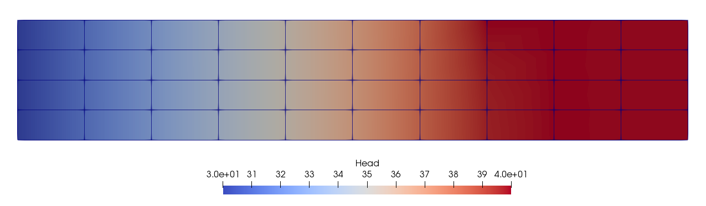

### Boundary conditions

#### Constant head boundaries
* At x = 0 m and z = -270 m up to the free surface set H = 30 m.
* The free surface equal to H = 40 m for x = [3600 3700].
#### Stresses
* Groundwater recharge is considered constant and equal to 0.0004 m/day, 

* Pumping:
  	* Well 1, x = 2300 m, top = -30m, bottom = -200m, Q = 2.5 m^3/day
  	* Well 2, x = 4200 m, top = -10m, bottom = -50m, Q = 1.5 m^3/day

#### Aquifer properties
For this example we assume that the aquifer is isotropic with K =  10 m/day.

#### Solution
This is a trivial problem that can be solved rapidly even using one processor. This is used as the first debugging test. The discretization and the solution after 14 iterations is shown below:

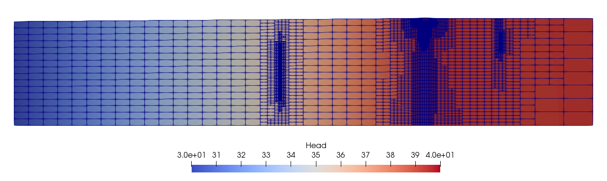

---

## 2nd Example (BOX2D_02)
### Domain
The domain of the second example is also a vertical cross section. The length of the aquifer is 9 km. The depth of the aquifer is variable. The bottom of the aquifer is defined as shown in the figure below. However what is shown as top is just the initial estimation of the free surface.

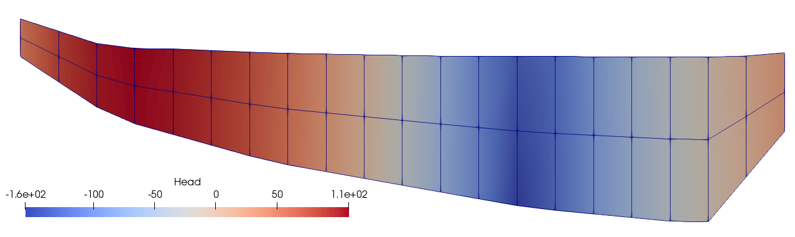

### Boundary conditions
#### Constant head boundaries
Two constant head boundaries are considered in this example. The hydraulic head on left side is set equal to 50 m and on the right side the hydraulic head is set equal to 30 m.

#### Stresses
* Groundwater recharge is uniform and equal to 0.12 m/day
* Pumping: For pumping we defined one well at 5950 m distance from the left side. The top of the screen is set to -250 m and the bottom of the screen at -350 m. The pumping rate is Q=1080/m^3/day

#### Aquifer properties
The hydraulic condactivity is uniform, isotropic and equal to 13 m/day.

#### Solution 
The following figures show the free surface and the discretization after 2 and 7 iterations\

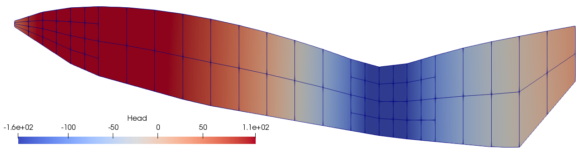
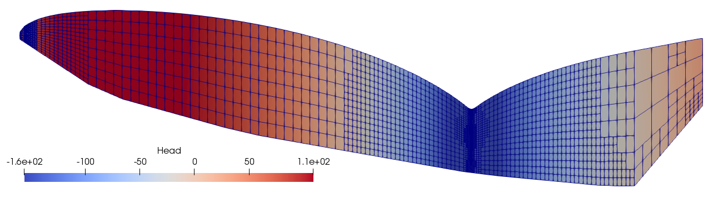

### Variations of the 2nd test problem
The 2nd problem is also sutable to test several other formats of the input files.
For example we can replace the constant hydraulic conductivity value with a variable hydraulic conductivity in zones. 

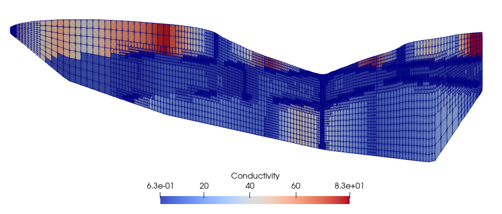

The above figure represents the hydraulic conductivity described in the file *KX_scatter_test02.npsat*. We can see that the domain is split into 3 zones where conductivity is constant vertically within each zone but varies liearly along the x axis.

We can also define the conductivity to be linearly interpolated in the vertical direction. The file *KX_scatter_test02_linear.npsat* gives an example of a linearly interpolated field.
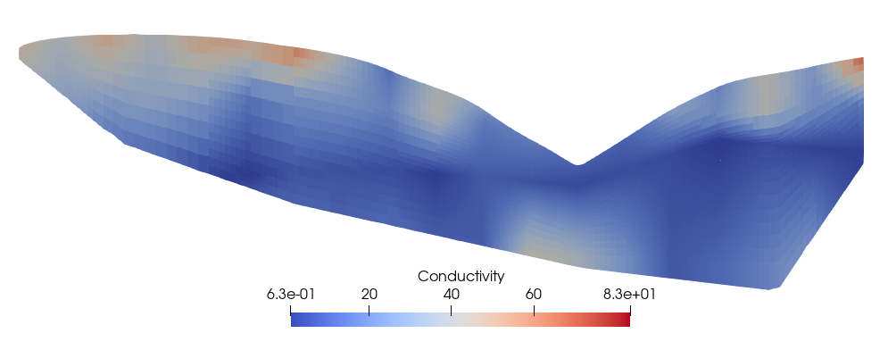

---

## 3rd Example (BOX2D_03)
### Domain
Similar to the previous examples the domain is a vertical cross section. The length of the domain is 48 km and the depth is variable. The figure below shows the bottom of the aquifer and the initial estimation of the free surface. 

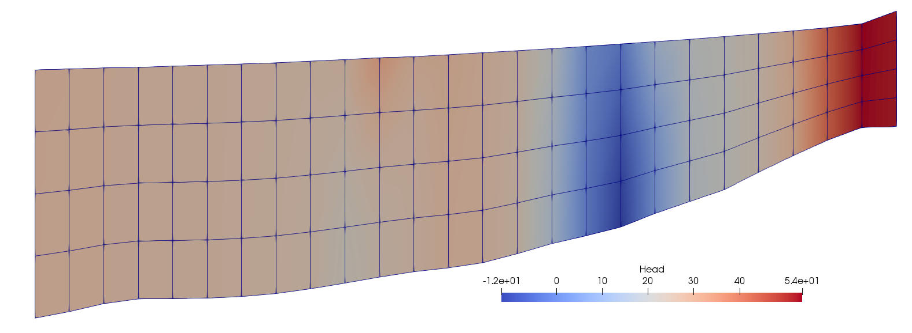

### Boundary conditions
#### Constant head boundaries
* Hydraulic head at the left side is set equal to 27 m
* Hydraulic head at the right side is set equal to 52 m

#### Stresses
* The groundwater recharge is variable as show in the figure

 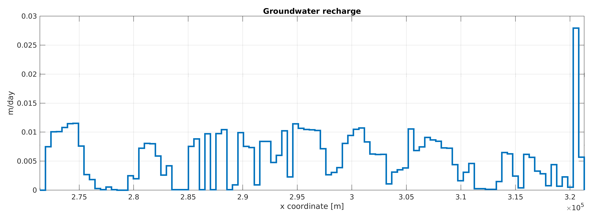
 
* Pumping:
There are 30 wells in the aquifer with total pumping equal to 225 m^3/day.

#### Aquifer properties
In this example the aquifer is considered isotropic along x and y. Both horizontal and vertical hydraulic conductivity are defined as a stratified interpolation functions. The hydraulic conductivities at the left side of the domain are higher compared to the values of the right side.

#### Solution 
The following figures show the free surface and the discretization after 2 and 8 refinement iterations. Due to the variability in the recharge along the relatively low hydraulic conductivity in the right side the free surface creates many dips around the wells. Note however that these figures are exaggerated 30 times in the vertical direction.

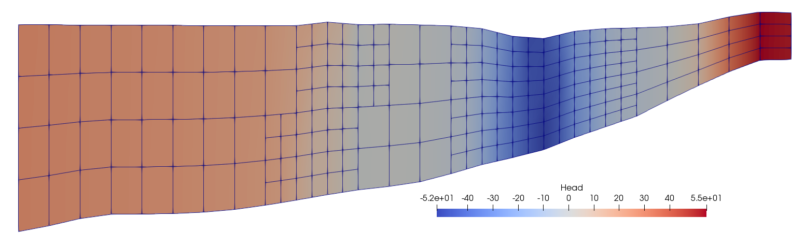
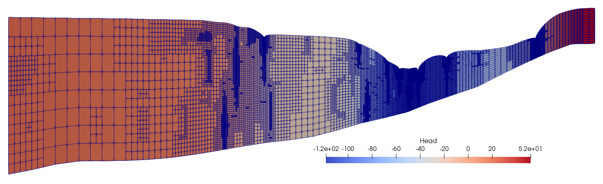
