# Overview
This example is primarily used for debugging and illustrating the various boundary conditions that can be applied in a domain. The *Dirichlet* boundary conditions are all specified in a single file. The *Neumann* boundary conditions are split into two categories. Groundwater recharge and other Neumann boundaries. Although groundwater Recharge is a type of Neumann boundary condition it is treated separately as it is always applied on the top, while the category Neumann boundary conditions in the input file it is used to set flows in boundaries of the domain other than the top.  

## Domain 
The domain of the example is a box with dimensions 5x5 km and depth 300 m approximately. The bottom of the aquifer is uniform and equal to -270 m. The initial approximation of the free surface is set to 30 m above msl.

## Stresses
* Groundwater recharge unless it is modified, it is assumed uniform and equal to 0.0002 m/day, which results in a total incoming volume of water from recharge equal to  5000 m^3/day.
* There are 19 wells with pumping rates varying from 100 to 500 m^3/day. Their total pumping equals the recharge amount.

# Dirichlet Boundary conditions
The purpose of this example is to test all the available boundary condition options of NPSAT. 
The format of the boundary condition file is the following:
- Number of boundaries
- TYPE N Value 
- Repeat N times the coordinates that describe the boundary


## Top boundary (Test 1 : dir_bc01.npsat)
 This type of boundary is a polygonal area applied on top (e.g. lake) that has constant head. In the example this is set to 30 m, while the polygon consist of 7 vertices. The file has the following format
```
1
TOP 7 30
x y  #repeat 7 times
```
**It is very important that the orientation of the polygon is counter clockwise**

The value does not have to be a constant value. On can pass a file that describe an interpolation function. 

We can see that that boundary polygon has been refined several times so that it is clrearly identified
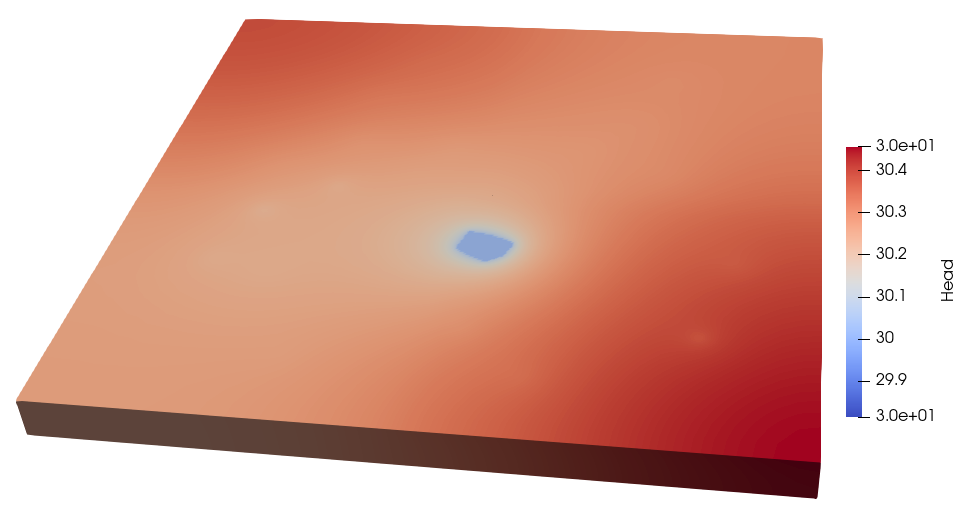

## Side Boundaries (Test 2 : dir_bc02.npsat) 
This type of boundary is used when the side of the domain is associated with a constant head boundary.
In the 2nd example we set two boundaries 
* The left side of the aquifer (x = 0) is set equal to 25 m. This value will be assigned to the entire depth.
* The right side of the aquifer (x =5000) is set equal to 40 m. However this value will be assigned only on the top layer of that side.

The file has the following format:
```
2
EDGE 2 25
x1 y1
x2 y2
EDGETOP 2 40
x1 y1
x2 y2
``` 
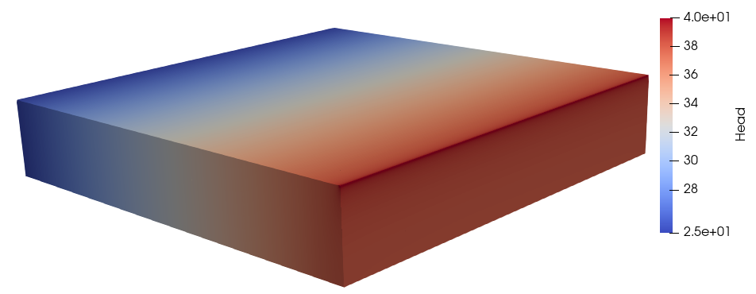

We can see that in the right side of the aquifer only the top row of elements has constant head equal to 40 m. 

## Side Boundaries variable (Test 3 : dir_bc03.npsat)
For the third example we will use the same boundaries as in the second example and change their values. Instead of using a uniform value along the boundary we will use variable interpolation functions.
* For the left boundary the head will vary also with depth.</br>
In particular the left boundary is divided into zones as shown in the following figure</br>
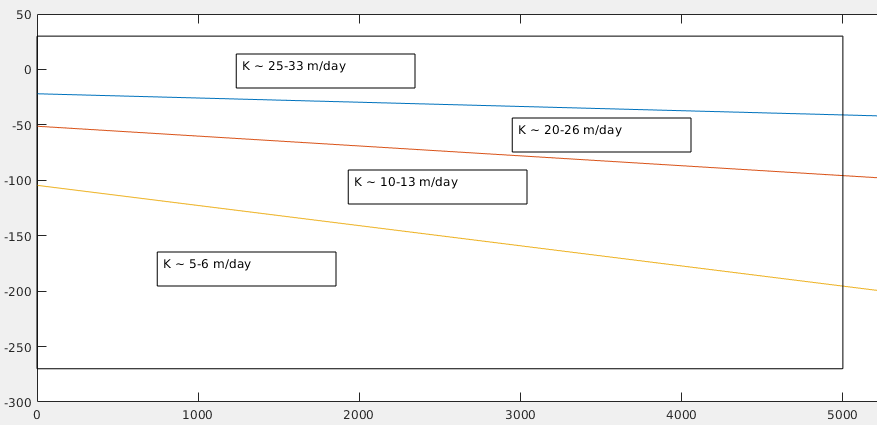

* For the right boundary only the top face is affected therefore we will use a variable interpolation function along the x-y plane. All z nodes will have the same constant head value for the same x,y location
The input file is modified in order to use the **BOUNDARY_LINE** interpolation function.
The following file is interpeted as follows. There are 2 boundary definitions. The first affects the entire edge **EDGE** and the second only the top row of the side **EDGETOP**.
The zero is the number of points that define the boundary. However here we use the **BOUNDARY_LINE** which defines the edge in the function itself.  
 
```
2
EDGE 0 box3d_leftv1.npsat
EDGETOP 0 box3d_rightv1.npsat
```
For illustration purposes we simulated the 3rd example in two ways. First we assume that the head between the zones is vertically constant within each zone. The constant head ar x = 0 becomes :
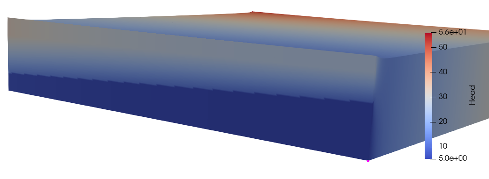

Secondly we repeated the simulation assuming linear gradient between the zones. In theis case the values correspnd to the elevations and vary linearly</br>
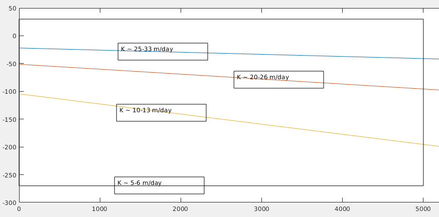</br>
The input file for this simulation is the *box3d_leftv1b.npsat* and the boundary becaomes:


## Side Boundaries non-colinear (Test 4 : dir_bc04.npsat)
This example is very similar to the previous one. This show that one can describe a boundary where the segments do not lay on the same vertical plane. 

For the following simulation we assume that the constant hydraulic head is defined for the segments (2500, 0)-(5000, 0)-(5000 2500). Although this is a polyline that constist of two segments it can be set as one boundary function. The file *box3d_bnd_lines_test04.npsat* describes the boundary function.
```
1
EDGETOP 0 box3d_bnd_lines.npsat
```
The head at the corner is set equal to 20 m and inreases linearly up to 50m to the right size and 40 to the left.
</br>
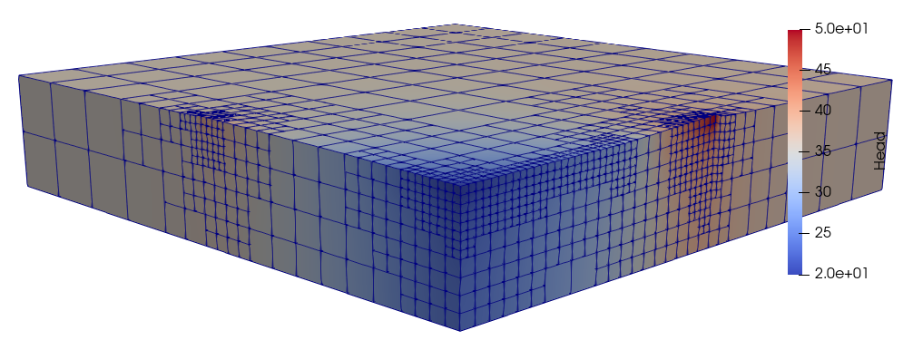

Note that for this case we do not provide and points to describe the boundary. The input file contains the definition of the segments along with the values.

# Neumann Boundary conditions
In the following section we illustrate the various interpolation methods one can use within npsat to describe 2D fluxes. Typical example is the groundwater recharge, which is a flux defined on the top

## Scatter interpolation
When the data are scatter or the geometry is not of rectangular shape it is more efficient to use scattered data interpolation.

The format of the scatter data is the following:
```
SCATTERED
2D
LINEAR
Npoints Ndata Nelements
x y v
.
.
.
ID1 ID2 ID3
.
.
.
```
The first keyword indicates the type of interpolation method
Next 2D or 3D is used to indicate whether there is a vartical variation
LINEAR or NEAREST is the type of interpolation
Npoints is the number of points, ie. the number of lines that follows must be Npoints.
Ndata is the number of columns that follow after the coordinates x and y. For 2D this is always 1. Nelements is the number of triangles that follow after the points and data list
An example is shown in the file *Rch_scattered.npsat*. Depending on the element interpolation type the results are quite different. The first figure shows the recharge distribution when the interpolation is set to linear, while the second shows the nearest interpolation. Generally it makes more sense to use linear interpolation with scattered data.</br>
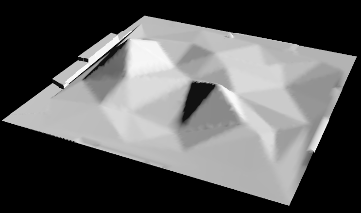

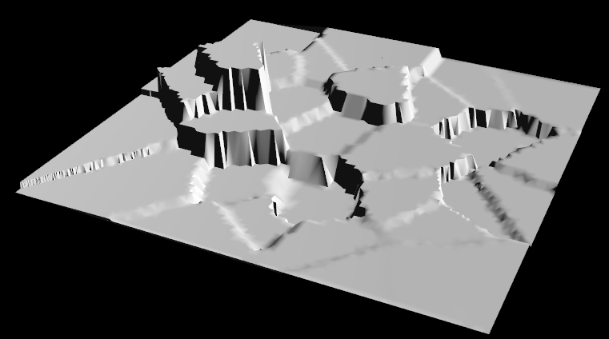


## Gridded interpolation
If the data can be organized into rows, columns and layers then it is possible to use the gridded interpolation format. The format of the gridded interpolation is described in [gridInterp](https://github.com/giorgk/gridInterp). An example of gridded interpolation is shown in the file *Rch_gridded.npsat*.
Similalry to the scattered interpolation there are two options linear and nearest which are shown in the figures below.

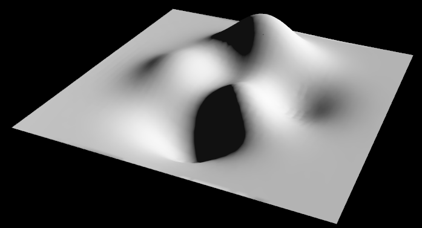
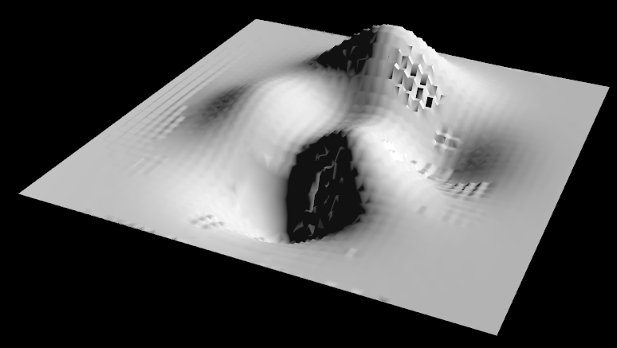

## Multi polygon/rectangle interpolation
### MULTIPOLY
The last type of interpolation discribed in this section is a combination of all of the above. The **MULTIPOLY** and **MULTIRECT** can be used in cases where a different interpolation method should be used in different parts of the domain. 

The input file for these options has the following format:
```
MULTIPOLY
Npoly 
Nverts TYPE VALUE
x y
.
.
.
```
The first keyword can be either MULTIPOLY or MULTIRECT.</br>
Next Npoly is the number of polygons where a separate interpolation function is defined. </br>
Then repeat `Npoly` times the remaining lines where Nverts is the number of vertices that define the polygon, the type can be either **CONST**, **SCATTERED** or **GRIDDED**, but not MULTIRECT or MULTIPOLY. The value is either a scalar value if the type is CONST or a file that describes the interpolation function.    
An example of the input file is the mult_var_rch.npsat.

The domain has been split into 3 zones as show in the figure
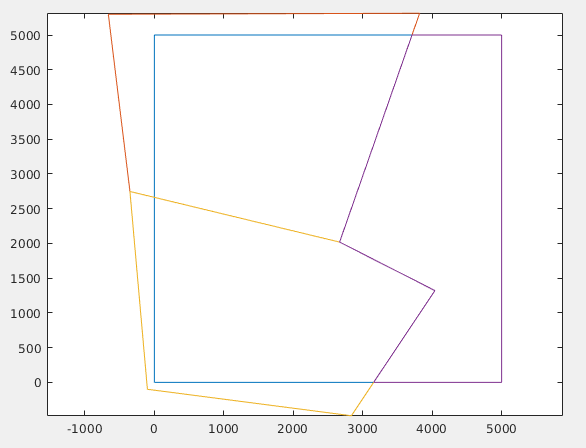

In each zone we set a different interpolation function. The area with red outline is using a scattered interpolation data while the other two polygons used gridded functions.
One of the gridded interpolation functions use nearest interpolation and the other linear. From the figure below this becomes quite obvious.

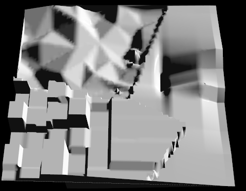

### MULTIRECT
The **MULTIRECT** option is very similar to **MULTIPOLY**. The only difference is the way the domain is divided into sub areas. In **MULTIPOLY** the polygonal areas can be of any shape with any number of vertices. However this comes with a cost where each function evaluation loops through the polygons to find which polygon containts the point in question. In **MULTIRECT** it is assumed that the polygons are orthogonal rectangles, therefore a point will be inside the polygon if it is inside the bounding box which is defined by two points the left lower and right upper. The format for the  **MULTIRECT** is the follwing:
```
MULTIRECT
Npoly
TYPE VALUE
Xmin Ymin Xmax Ymax
.
.
.
```
There is no need to set the number of vertices and the 2 corner points are set on the same line.

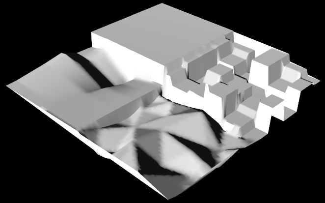


